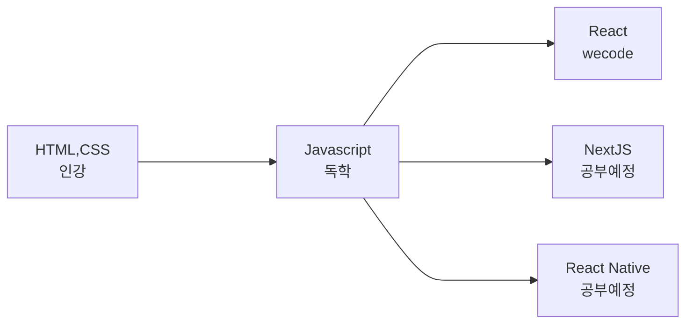

## To be 꾸준하게 달리는 개발자 #김효성# 입니다

 
<h3 align="center"><b>♰ Tech Stack ♰</b></h3>
 
 

</a> &nbsp
</a> &nbsp
</a> &nbsp
</a> &nbsp
</a> &nbsp
<!-- </a> &nbsp -->

 
 
<h3 align="center"><b>♰ History ♰</b></h3>
 
 

<h3 align="center"><b>♰ Velog & Github ♰</b></h3>

 
  
  
 
  
  

 

 

## Daily 목표 
 - **1일 1커밋 목표** (최소 6개월은 해보자..)
- **개인 쇼핑몰 프로젝트 진행중**
- **Daily 워밍업으로 프로그래머스 문제 풀기(현재 level0 정복중)**
- **[Hyozzi Velog](https://velog.io/@gytjdwlwhs) : 스택 or 언어 공부한거 기록중**
- **[Hyozzi Notion](https://www.notion.so/Daily-To-do-List-5348b1dbd01c43cd9d8d84b4fec586aa) : 인증샷 Daily 투두리스트**
